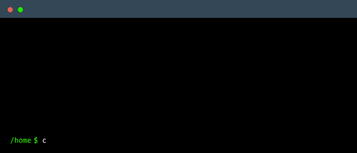

    
     
     
    
    
    <h3>JavaGym</h3>
    <h4>Lösungen zum  Informatik Vorkurs der Uni Due</h4>

---

Hier sind die Lösungen vom JavaGym und den MissionDisks des Informatik Vorkurses der Universität Duisburg-Essen. Aber immer dran denken: $ verstehen > ctrl+c$

